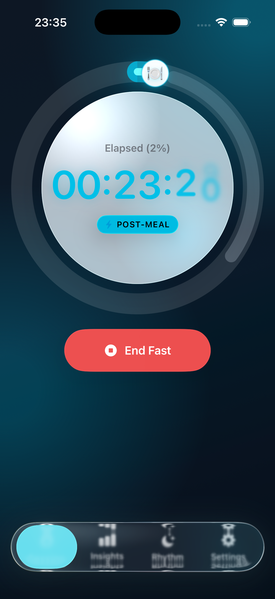

# Pill Menu Enhancement TODOs

## Issues Identified (from screenshot)

### Critical
1. **Selected tab glass blob is oversized** - The cyan selection capsule is way too large and opaque, covering the entire left portion of the pill
2. **Tab labels barely readable** - "Insights", "Rhythm", "Settings" text is too dim and obscured by overlays
3. **First tab icon/label missing** - "Session" text and icon aren't visible, just the selection blob

### Medium Priority
4. **Magnify scale too aggressive** - 1.15x scale is causing the selection to grow too large; reduce to ~1.05x
5. **Prismatic edge effects not visible** - The PrismaticEdge overlay effects aren't rendering or are too subtle

### Low Priority
6. **Drag-to-slide gesture** - Verify drag gesture still works after hit-testing changes

## Proposed Fixes

### Selection Glass
- Change from `Capsule().fill(.clear).glassEffect(...)` to just applying glass directly to the label content
- Or reduce the selection background size with explicit frame/padding
- Consider using `.glassEffect(.regular)` without tint for selection, add tint to icon/text instead

### Text Legibility
- Increase `.foregroundStyle` opacity for unselected tabs (currently 0.65, try 0.85)
- Add stronger text shadow or use `.fontWeight(.bold)`
- Consider reducing overlay effect intensities

### Magnify Effect
- Reduce `magnifyScale` from 1.15 to 1.05 for selected, 1.03 for hovered
- The scale applies to the entire button including its background - may need to only scale the content

### Edge Refraction
- Check if PrismaticEdge is actually rendering (may be clipped incorrectly)
- Increase stroke lineWidth and opacity values
- Consider applying effects to outer container instead of ZStack overlay

## Files to Modify
- `GlassticPackage/Sources/GlassticFeature/ContentView.swift` - BottomPillMenu struct (lines 200-340)
