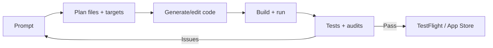

# Architecture diagrams (Mermaid)

## iPhone ↔ Watch data flow (HealthKit source of truth)

```mermaid
flowchart LR
  subgraph Watch[Apple Watch]
    WS[watchOS App] -->|Live capture| HKW[HealthKit (watch short-term)]
    WS -->|WCSession request| WCW[WCSession]
  end

  subgraph Phone[iPhone]
    IOS[iOS App] --> HKP[HealthKit (iPhone full history)]
    IOS -->|Inference| ML[Core ML / Vision / NLP]
    IOS --> WCP[WCSession]
  end

  WCW <--> WCP
  HKW -->|Sync via system / iCloud| HKP
  IOS -->|Insights| WCP
```

## On-device ML pipeline

```mermaid
flowchart TD
  Sensors[Sensor signals] --> Pre[Preprocess]
  Pre --> Model[Core ML model]
  Model --> Post[Postprocess + confidence gating]
  Post --> UI[User-facing insight]
  Post --> Store[Optional storage (HealthKit / local)]
```

## Agentic workflow


